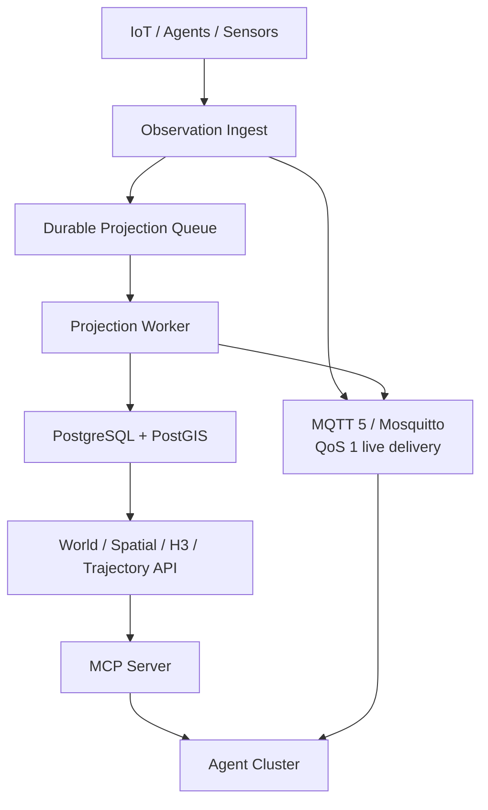

# Geospatial Operational World Model PoC

`geospatial-world-model-poc` 是面向多 IoT-Agent 集群的共享、实时、可查询运行世界模型工程基线。**工程可行性结论 GO；当前 release 投产结论 CONDITIONAL GO**：PostgreSQL/PostGIS + h3-pg + MQTT 5/Mosquitto + TypeScript + MCP 可以在 4–8 周内形成可供真实 Agent 使用的 MVP；本仓库已实现闭环 PoC，但仍需在具备 Docker 的目标机器关闭数据库/消息总线验收门。

## 已实现能力

- Typed World Object、当前状态、几何、Typed Relation 与单调 `worldVersion`
- Observation 校验、幂等去重、乱序/迟到决策、确定性投影、Freshness、Confidence、Provenance
- PostGIS nearby / nearest / within / intersection / containing area / route proximity / distance
- h3-pg 原生 `h3index` 存储、R7–R10 投影、聚合、邻居、hotspot/coldspot、数据库内 parent/children drill-down
- Current Position 与 Historical Track 分离；距离、停止/驻留、路线偏离分析
- `ObjectEnteredArea` / `ObjectExitedArea`，PostgreSQL 持久事件、MQTT QoS 1 实时发布及 SSE 订阅
- 8 个可运行 MCP Tools；Agent 不需理解 SQL、PostGIS 或 H3
- 可重复的 IoT simulator、C1–C10 场景测试、replay 工具、进程内和 PostGIS benchmark

## 最小架构



PostgreSQL 是 Observation、当前 World State、空间索引、事件、H3 态势和轨迹的唯一持久事实系统，也是 replay source。MQTT 只承担实时、at-least-once 投递，不被当作历史日志或第二事实源；断线恢复由 QoS 1/session 支持，任意历史重放由 PostgreSQL API/SSE backlog 提供。Observation 永不直接覆盖 State；只有 Projection Worker 能依据融合策略更新当前状态。

## 十分钟启动目标

前置条件：Docker Engine 24+、Compose v2、至少 4 CPU / 8 GiB RAM。

```bash
cp .env.example .env
docker compose up -d --build
docker compose run --rm world-api node dist/scripts/seed.js
curl http://localhost:3000/health
curl http://localhost:3002/health
curl http://localhost:3001/health
```

服务端口：World API `3000`、MCP Streamable HTTP `3001/mcp`、Observation Ingest `3002`、PostgreSQL `5432`、MQTT `1883`。

持续模拟 100 个移动对象：

```bash
docker compose --profile demo up -d simulator
```

停止但保留数据：

```bash
docker compose down
```

## 第一次 Agent 查询

```bash
curl -s http://localhost:3000/spatial/nearby \
  -H 'content-type: application/json' \
  -d '{
    "location":{"lat":39.902,"lon":116.405},
    "objectTypes":["UGV"],
    "radiusM":5000,
    "filter":{"status":"AVAILABLE"},
    "limit":5
  }'
```

返回不是数据库行，而是：

```json
{
  "summary": { "count": 5, "nearestDistanceM": 230 },
  "facts": [],
  "context": {
    "worldVersion": 10283,
    "dataFreshnessMs": 530,
    "queryTimeMs": 8
  }
}
```

MCP 客户端连接 `http://localhost:3001/mcp`。stdio 模式可执行：

```bash
node dist/services/world-mcp-server/src/index.js
```

原生 MQTT Agent 可订阅实时事件：

```bash
mosquitto_sub -h localhost -p 1883 -q 1 -t 'gowm/event/#'
```

MQTT 只用于 live delivery；历史补偿使用 `GET /events?sinceWorldVersion=<version>` 或 `/events/stream` 的 PostgreSQL backlog。

## 验证

本地、无需数据库的完整验证：

```bash
npm ci
npm run check
npm test
npm run benchmark
```

具备 Docker 时的一键验收：

```bash
npm run acceptance
```

该命令会构建栈、安装并验证 h3-pg migration、seed、API/MCP/地理围栏端到端测试，并运行最高 1M 对象 PostGIS 基准、100/1k/10k events/s offered-load、storage growth、replay 和容器/Mosquitto 指标。可用 `BENCH_MAX_OBJECTS=100000 LOAD_TARGET_RATES=100,1000` 缩小资源消耗。

核心字段 replay：

```bash
npm run replay -- --subject ugv-001
```

脚本会删除该对象的派生当前状态、按事件时间重放 Observation，并比较 `type/geometry/state/confidence/observedAt/provenance` 的 SHA-256；不会删除原始 Observation。

## 当前验证边界

本仓库创建时所在执行环境没有 Docker 和 PostgreSQL 客户端。因此已实测并保存的是：TypeScript 构建、21 个单元/场景/MCP 测试，以及 1k/10k/100k/1M 对象、100/1k/10k Observation、10/100/1k/10k 移动对象的真实进程内基准。Docker/PostGIS/h3-pg/MQTT 结果必须在具备 Docker 的机器执行 `npm run acceptance` 后才可标记为通过；报告没有把静态 Compose 校验写成运行成功。

## 文档索引

1. [可行性与 Q1–Q20](docs/01_FEASIBILITY_REPORT.md)
2. [World Model](docs/02_WORLD_MODEL_DESIGN.md)
3. [Spatial Query](docs/03_SPATIAL_QUERY_DESIGN.md)
4. [H3 Situation](docs/04_H3_SITUATION_DESIGN.md)
5. [Observation / Event](docs/05_OBSERVATION_EVENT_DESIGN.md)
6. [Trajectory](docs/06_TRAJECTORY_DESIGN.md)
7. [Agent Tools](docs/07_AGENT_TOOL_DESIGN.md)
8. [技术决策](docs/08_TECHNOLOGY_DECISIONS.md)
9. [Benchmark](docs/09_BENCHMARK_REPORT.md)
10. [推荐架构](docs/10_RECOMMENDED_ARCHITECTURE.md)
11. [实施 Roadmap](docs/11_IMPLEMENTATION_ROADMAP.md)
12. [验收报告](docs/12_ACCEPTANCE_REPORT.md)
13. [官方证据矩阵](research/evidence-matrix.md)

## 项目边界

明确不在本阶段建设：完整知识图谱/Palantir-style Ontology、LLM 推理、Planning/Workflow/Mission Planner、Routing/Coverage Solver、CV/Raster AI、3D/Cesium、物理仿真、复杂 Bayesian Fusion、ML Prediction、Full OGC Server、Kubernetes。已有 H3 Toolkit 与 Coverage Planner 只通过稳定 API/Event 接入。

License: MIT。依赖许可证与版本证据见 `research/evidence-matrix.md`。
