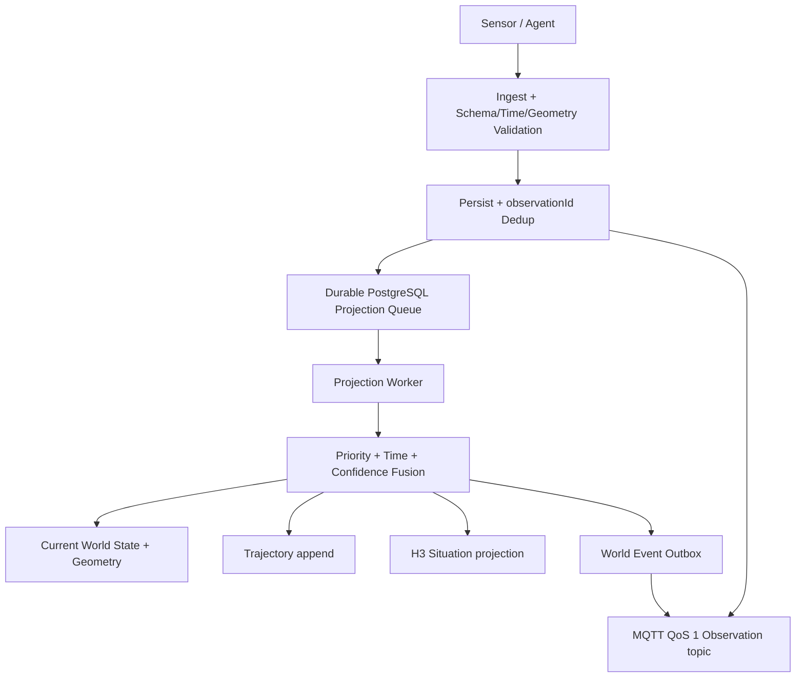

# 05 — Observation and Event Design

> Historical v1.1 baseline. The v1.2 canonical Observation/TimeSolution/Measurement model supersedes conflicting sections.

## 三种领域事实

| 名称 | 含义 | 是否 immutable | 是否改变 current state |
|---|---|---:|---:|
| Observation | observer 对 subject 在某时刻的带置信度陈述 | 是 | 不直接改变 |
| World Event | 系统确认接收、状态改变或空间条件发生 | 是 | 本身不写 state |
| StateChange | Projection 胜出后产生的 World Event | 是 | 表示 state 已在同一事务改变 |

因此 `ObservationReceived` 只证明系统持久化了证据；`ObjectMoved/ObjectStateChanged` 才证明该证据赢得 projection。重复、迟到或低优先级 Observation 可保留却不产生 StateChange。

## Observation Envelope 1.0

```json
{
  "observationId": "obs-01H...",
  "observer": { "type": "Camera", "id": "camera-12" },
  "subject": { "type": "Vehicle", "id": "vehicle-83" },
  "observationType": "position",
  "geometry": { "type": "Point", "coordinates": [116.4, 39.9] },
  "value": { "speed": 8.1, "status": "MOVING" },
  "confidence": 0.91,
  "observedAt": "2026-08-11T01:02:03.000Z",
  "receivedAt": "2026-08-11T01:02:03.120Z",
  "source": "camera",
  "correlationId": "frame-997",
  "metadata": { "modelVersion": "detector-4.2" },
  "schemaVersion": "1.0"
}
```

`observationId` 由 source 生成且必须稳定；retry 不得换 ID。若 legacy source 无 ID，edge adapter 用 canonical source id + subject + observedAt + payload hash 生成确定性 ID。

## Pipeline



数据库 queue 是当前 PoC 的投影 durability ground truth；MQTT 不可用时 ingest 仍可接收并排队。Event outbox 的未发布行由 worker relay，收到 broker PUBACK 后才写 `published_at`。这样避免“先发 bus、DB rollback”造成幽灵状态，也不把 broker 误当作 replay source。

## Validation 与异常处理

| 情形 | Detection | 行为 | State impact |
|---|---|---|---|
| duplicate | observation PK 冲突 | 返回 200 `duplicate`，不重复入队 | 无 |
| invalid schema | Zod | 422，不持久 | 无 |
| invalid geometry | range/ring/type + PostGIS validity | 422，不持久 | 无 |
| bad timestamp | 无法 parse | 422 | 无 |
| future timestamp | `observedAt > now + skew` | 422 | 无 |
| late arrival | `receivedAt-observedAt > maxLate` | 持久为 `late`、不投影 | 无；可离线 replay |
| out of order | 比 current event time 老过 policy | 持久/轨迹可保留，projection superseded | current 不变 |
| stale current | `now-lastObservedAt > SLA` | 读结果 `stale=true` | 不删除；Agent显式判断 |
| transient worker failure | transaction rollback | queue unlock + exponential backoff | 无部分写 |

PoC 中 late observation 不进 trajectory，因为不进入 projector；生产若需要完整 raw track，可增加 raw trajectory projection，而 current-state projector 仍不应用它。

## 确定性多源投影策略

PoC 不假装实现 Bayesian Fusion。冲突窗口默认 5s，排序逻辑：

1. 无 current：apply。
2. incoming 比 current 新超过 conflict window：apply。
3. 老过允许乱序窗口：reject current update。
4. 窗口内比较配置的 source priority。
5. 同优先级比较 confidence。
6. 再比较 observedAt。
7. 完全相同用 `observationId` lexical order 稳定 tie-break。

默认示例：operator 100 > UAV 80 > UGV 75 > camera 70 > sensor 60 > simulator 50。它只是部署配置，正式值必须由数据 owner/安全评审批准。

未来 Fusion 扩展点：`ProjectionPolicy` 接口按 `objectType + field + observationType` 选择 projector，可实现 weighted average、track association、Kalman/Bayesian 等；输出仍必须包含胜出 state、confidence 和 `evidence[]`，不能绕过 immutable Observation。

## Event Envelope 1.0

```json
{
  "eventId": "uuid",
  "eventType": "ObjectEnteredArea",
  "subject": { "type": "UGV", "id": "UGV-3" },
  "timestamp": "2026-08-11T01:02:03.000Z",
  "geometry": { "type": "Point", "coordinates": [116.4, 39.9] },
  "worldVersion": 10283,
  "correlationId": "mission-7",
  "causationId": "obs-01H...",
  "payload": { "areaId": "AOI-1" },
  "schemaVersion": "1.0"
}
```

已定义：`ObservationReceived`、`ObjectCreated`、`ObjectUpdated`、`ObjectMoved`、`ObjectStateChanged`、`ObjectEnteredArea`、`ObjectExitedArea`、`ObjectNearObject`、`SituationCreated`、`SituationUpdated`、`CoverageChanged`、`TrajectoryUpdated`。

PoC 实际产生 ObservationReceived、ObjectCreated、ObjectMoved/ObjectStateChanged、Entered/Exited 和 TrajectoryUpdated；其余为稳定 vocabulary/下一阶段 projector，不伪称已实现检测。

## Geofence subscription

Projection 新位置用 PostGIS `ST_Covers` 计算当前 area set，并与 `object_area_membership` 比较：

- `new - old` → insert membership + `ObjectEnteredArea`
- `old - new` → delete membership + `ObjectExitedArea`

订阅：

```text
GET /events/stream?objectType=UGV&eventType=ObjectEnteredArea&areaId=AOI-1
```

SSE 先订阅 MQTT live topic 并暂存新消息，再读取持久 `world_event` backlog，最后按 `eventId` 去重合并；这样关闭查询与订阅之间的竞态窗口。生产客户端必须保存最后 `worldVersion/eventId` 并去重；QoS 1 和网络重连都可能重送。

原生 MQTT 主题契约：

```text
gowm/observation/{subjectType}/{observationType}
gowm/event/{eventType}/{subjectType}
```

payload 为 Event/Observation Envelope JSON；PoC 使用 MQTT 5、QoS 1、`retain=false`、24h message expiry，并在 user properties 中携带 `messageId/schemaVersion`。需要短时断线续送的 Agent 使用稳定 `clientId`、`clean=false` 和 session expiry；需要任意历史范围的 Agent 调用 `/events?sinceWorldVersion=` 或 SSE backlog，不能依赖 retained message。

## Event Bus 决策

| 维度 (1差–5好) | JetStream | Kafka | Redpanda | MQTT 5 |
|---|---:|---:|---:|---:|
| Day-1 部署 | 5 | 2 | 3 | 5 |
| Durability/replay | 4 | 5 | 5 | 2 |
| Ordering/consumer groups | 4 | 5 | 5 | 2 |
| IoT edge compatibility | 4 | 2 | 2 | 5 |
| Agent compatibility | 5 | 3 | 3 | 4 |
| Throughput ceiling | 4 | 5 | 5 | 3 |
| 运维成本 | 5 | 2 | 3 | 5 |
| 开源/许可简单度 | 5 | 5 | 2 | 5 |

选择 **MQTT 5 + Eclipse Mosquitto**，因为它是多个 IoT 团队可直接消费的最小共同协议，Day-1 成本最低。MQTT 只承担 live delivery；PostgreSQL observation/event tables 提供 durability、查询与 replay，从而补齐 MQTT 不擅长的任意历史日志语义。Kafka/Redpanda 的理论吞吐不能抵消当前复杂度；只有 sustained accepted ingress >50k events/s 30 分钟，或必须提供多区域长 retention/组织级分区日志时才迁移。50k/s 是容量规划门槛，不是当前环境实测值；上线前需专项 benchmark。JetStream 在 v1.1 明确不采用，避免同时维护两套 broker 协议。

## SensorThings mapping

| SensorThings 1.1 | GOWM | 策略 |
|---|---|---|
| Thing | `world_object` Device/asset | 保留 external id |
| Location/HistoricalLocation | current geometry / trajectory | Location 可为非移动资产 |
| Sensor | `Sensor`/`Camera` observer object | metadata 描述 procedure/model |
| ObservedProperty | `observationType` + registry | canonical URI 存 metadata |
| Datastream | source + observer + observed property profile | 不是强制内部 object |
| Observation.result | `value` | resultTime 可映 received/processing metadata |
| phenomenonTime | `observedAt` | 核心 event time |
| FeatureOfInterest | `subject` + geometry | 可保留 external FOI ref |
| Tasking | future command adapter | 不进入 current sensing MVP |
| WebSub | event subscription adapter | 不宣称 WebSub conformance |

目标是 schema compatibility/import-export，不实现 OData navigation、完整 entity set、SensorThings MQTT binding profile 或 conformance test suite；GOWM 自身 MQTT topic 是独立的 Agent/IoT contract。

## Replay

原始 Observation 永不修改（处理状态字段除外），因此可：停 projector → 清除指定派生 state/geometry/trajectory/membership → 按 `observedAt,receivedAt,observationId` 重排 → 运行相同 projector → 比较核心字段 hash。

`npm run replay -- --subject <id>` 实现 subject-level 核心校验。全量 deterministic reconstruction 还需：版本化 policy/config、重建 H3 counters、隔离 side effects、记录 projection run checksum；列为 Week 4/Stage 1 gate。
