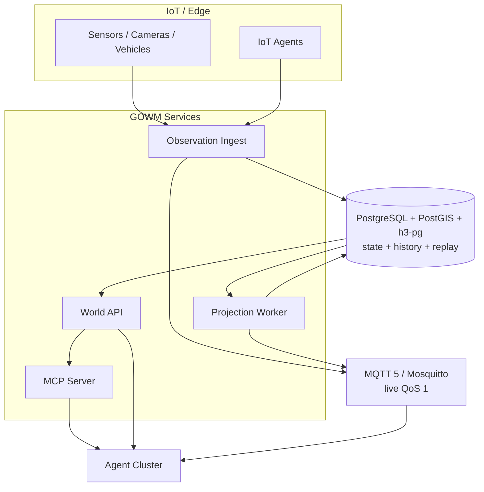

# 10 — Recommended Architecture

> Historical v1.1 baseline. See document 13 for the GOWM+ foundation / STAS application split.

## 最终建议

**Feasibility: GO. Release/production use: CONDITIONAL GO.**

继续建设独立 GOWM，但保持为 operational world-state plane。当前条件是必须在目标 Docker host 通过 G1 与 DB/h3-pg/MQTT-backed G2–G10，随后才允许真实 Agent 将其用于自动执行；在此之前只用于开发/影子流量。

## Stage 0/1 目标架构

### 组件边界

| Component | 责任 | 不负责 |
|---|---|---|
| Observation Ingest | envelope validation、time/geometry check、dedup、persist、queue/outbox | 融合、直接更新 world state |
| Projection Worker | ordered fusion、current state、trajectory、H3、geofence、events | Agent API、planning |
| World API | World/Spatial/Situation/Observation/Event/Trajectory query + SSE | 直接接设备协议 |
| MCP Server | Agent-friendly tool adapter | DB access、业务逻辑复制 |
| PostgreSQL/PostGIS/h3-pg | 唯一持久事实、事务、空间/H3 索引、历史与 replay | live pub/sub |
| MQTT/Mosquitto | Observation/Event QoS 1 live delivery、IoT/Agent topic | authoritative state、任意历史 replay |
| Simulator | deterministic test traffic/geofence crossing | production source |

尽管代码按 packages/services 组织，Stage 0/1 不强制独立扩缩每个模块。可将 World API 与 ingest 合并部署，projection worker 独立；逻辑边界用于测试和未来扩展，不以服务数量衡量成功。

## Data ownership

| 数据 | Authoritative owner | Rebuild source | Cache/transport |
|---|---|---|---|
| Object identity/properties | PostgreSQL world_object | asset/admin commands | API cache optional |
| Current dynamic state | PostgreSQL world_object_state | accepted observations + policy | Agent local TTL cache |
| Current geometry | PostgreSQL world_object_geometry | winning position observation | h3-pg `h3index` derived |
| Observation history | PostgreSQL world_observation | source ingress | MQTT live delivery |
| Event history | PostgreSQL world_event | projector | MQTT live + DB/SSE replay |
| Track history | PostgreSQL trajectory_point | position observations | future analytical replica |
| Situation cells | PostgreSQL situation_cell (`h3index`) | current geometry + observations | parent materialization only if measured |

任何新 integration 必须填 ownership 表；不能让 Ditto/MQTT broker/Agent cache 成为同字段第二事实源。

## 关键路径

### Observation → World State

1. adapter 生成稳定 observationId、UTC event time 和 source identity；
2. ingest Zod/geometry/time validation；
3. PostgreSQL transaction append observation + projection queue + ObservationReceived outbox；
4. worker claim with `SKIP LOCKED`；
5. subject lock + deterministic fusion；
6. winning evidence upsert state/geometry + next worldVersion；所有 Point evidence idempotently append track；
7. update H3 cell/membership；insert events；mark projected in same transaction；
8. outbox 以 MQTT QoS 1 发布，收到 PUBACK 后标记；Agent SSE/native MQTT subscriber receives event；历史补偿从 PostgreSQL 读取。

### Query

Agent → MCP/REST → PostGIS/current tables → `summary + facts + context`。无 DB credential 下发给 Agent。

### Replay

停止/隔离 projector → 选 policy version → 清派生数据 → ordered observations → same projector → checksum/core equality → 切换 read view。全量 production replay 应在 shadow schema 做，不在 live tables truncate。

## Deployment profile

Stage 1 建议起点：

- PostgreSQL 4–8 vCPU / 16–32 GiB / NVMe，定期 backup + PITR；
- World API 2 replicas（无状态）；
- Ingest 2 replicas（无状态，DB idempotency）；
- Projection worker 2 replicas，按 queue claim 横向扩；
- PoC Mosquitto 单节点、启用磁盘 persistence；Stage 1 依靠 PostgreSQL backlog 补偿 broker restart 窗口；Stage 2 在真实 HA SLO 下选择并验证支持 session/failover 的 MQTT 部署，不把单节点伪称 HA；
- MCP 2 replicas，stateless HTTP；
- OpenTelemetry/Prometheus metrics，structured log 带 correlation/causation。

这些是初始工程 sizing，不是容量保证；以目标环境 benchmark 调整。

## Staged Architecture

### Stage 0 — PoC

证明五个闭环：World、Spatial、H3 Situation、Observation/Event、Trajectory；Docker Compose、simulator、MCP、C1–C10、benchmark。当前仓库提供全部实现，Docker-backed evidence 待目标 host。

### Stage 1 — MVP

真实 IoT Agent 影子/受控使用：source registry、field policy、per-type freshness、auth/tenant、metrics、retention/partition、dead-letter/reprocess、full replay reconciliation、SDK/tool docs。仍保持一个数据库和一个 MQTT broker，历史 replay 不复制到 broker。

### Stage 2 — Operational

HA、RBAC、audit、PITR/DR、backpressure、schema registry/governance、SLO/error budgets、rolling migrations、30-day soak、security hardening。此阶段才重新评估 Ditto policy/connectivity、Timescale、Kubernetes。

### Stage 3 — Intelligence

在证据链不变前提下增加 field-level fusion、Situation Detection、Coverage/Network Intelligence、prediction。模型输出也必须作为 Observation/evidence 进入，不可绕过 provenance。

### Stage 4 — Operational Digital Twin

Simulation/what-if/action/mission impact/world-state branching。分支 state 与 operational truth 必须显式 namespace；simulation 永不覆盖 live world。

## Migration triggers

| 迁移 | Trigger | 迁移形态 |
|---|---|---|
| TimescaleDB | >100M track points 或 PostgreSQL track p95 >200ms after tuning | 同 PostgreSQL extension/hypertable |
| ClickHouse | >1B points 或 >20k points/s 且 OLAP SLO 失败 | append-only analytical projection；current 留 PostGIS |
| Kafka | >50k accepted events/s 30min 或多区域长日志要求 | outbox dual-publish + consumer parity + cutover |
| H3 parent materialization | h3-pg parent-filter p95 >50ms after query/index tuning | 增加 R7/R8/R9 generated/materialized parent columns + B-tree |
| Ditto | per-feature policy/industrial connectivity 已成 Top-10 value | bounded device twin adapter；field ownership |
| Kubernetes | platform/HA/rolling deploy requirement | Compose manifests 先转 health/SLO contract |

## Risk Register

| Risk | Likelihood | Impact | Mitigation / gate |
|---|---:|---:|---|
| 多源语义/信任配置错误 | 4 | 5 | field ownership、policy version、evidence UI、shadow compare |
| 设备时钟漂移/乱序 | 4 | 4 | skew metrics、source clock health、event-time watermark |
| H3 近似被误当精确边界 | 3 | 5 | safety query 必回 PostGIS；API docs/warning |
| at-least-once duplicate | 4 | 4 | observationId/eventId unique + idempotent projector |
| trajectory storage增长 | 4 | 3 | retention/partition/size alarm；Timescale trigger |
| projection lag/backpressure | 3 | 5 | queue lag/oldest age、autoscale、ingest admission control |
| 双 Source of Truth | 3 | 5 | ownership registry、single-writer、adapter contract |
| 未完成目标环境 benchmark | 5（当前） | 5 | G1/G10 阻断 production sign-off |

最大技术风险不是数据库吞吐，而是“系统给出统一但错误/过期的状态”。因此 Freshness、Confidence、Provenance 是 P0 safety contract，不是装饰字段。

## 后续集成

- Coverage Planner：读 area/H3 coverage，写版本化 result relation/event；不把 solver 移入 GOWM。
- Network Routing：读 current objects/road geometry，返回 route id/version；Route 可注册为 World Object。
- Situation Awareness：订阅 observations/events，输出带 modelVersion 的 Situation Observation。
- Simulation：读指定 worldVersion snapshot，写 branch namespace，不写 live state。

## 明确不建设

Stage 0/1 不建设 full KG/Ontology、Palantir-style platform、LLM reasoning/planning、workflow/mission/routing/coverage solver、CV/raster AI、3D/Cesium、physics、complex fusion、ML prediction、full OGC server、Kubernetes。每项若未来进入，必须重新通过 High-value score 和 ownership gate。
