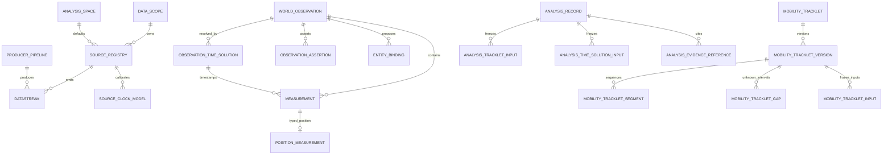

# GOWM+ v1.2 architecture

## Decision

Use **GOWM+ as the shared foundation and STAS as a deterministic application
layer**. This is preferable to either embedding STAS into the world-state service
or keeping two independent observation/trajectory stores.

The split is architectural, not merely deployment packaging:

- GOWM+ owns stable identities, immutable evidence, source/time/CRS governance,
  current-world projections, spatial/H3 primitives and source-local trajectory
  versions.
- STAS owns bounded analytical queries, candidate discovery, exact calculation,
  evidence assembly, method snapshots and tool contracts.
- Entity resolution, relationships, behavior and intent remain above STAS.

## Layer model

| Layer | GOWM+ v1.2 responsibility | Outside responsibility |
|---|---|---|
| L0 access | versioned adapter/stream/source registry, raw reference, idempotent receipt | source-specific decoding implementation |
| L1 normalization | server receipt time, corrected time solution, projected metric AnalysisSpace, typed accuracy and lineage | probabilistic sensor fusion |
| L2 movement construction | source + tracker-session + local-target Tracklet, explicit cuts, SequenceSet, gap/version lineage | cross-source entity identity |
| L3 analysis | shared evidence records/contracts; STAS executes deterministic tools | same-entity verdict |
| L4 reasoning | exposes traceable evidence to agents | relation/intent/suspicion decisions |

## Logical data model



### Observation semantics

`world_observation` is an immutable event/fact envelope. It stores who/what
reported, source-local record revision, data scope, origin, raw reference and
multiple upstream times. It does not force all values into JSON.

`observation_time_solution` separates the estimated phenomenon time and half-open
uncertainty window from source, result, network receipt and processing times. A
clock model version is immutable and independently referenced.

`measurement` separates parsed/native, normalized and fused-derived values.
`position_measurement` requires an analysis-space point and one explicit accuracy
model: HARD_RADIUS, STDDEV, COVARIANCE, INTERVAL or UNKNOWN. Algorithm confidence
is not position accuracy.

`observation_assertion` stores classification or other claims separately from the
measurement fact and names the input measurement IDs.

### Mobility semantics

A logical Tracklet key is:

```text
(dataScope, source, trackerSession, sourceLocalTargetId, analysisSpace)
```

It is never keyed by a resolved world entity. The optional world-object binding
is a projection and may remain null.

The builder cuts before a sample when any v1.2 rule fires:

- first sample;
- manual cut;
- missing/changed continuity token;
- maximum time gap;
- maximum distance gap;
- maximum required speed.

Every continuous group becomes a linear MobilityDB Sequence. All groups are
wrapped in one SequenceSet, even when there is only one group. Gap intervals are
stored separately with open bounds and reason/observability fields. No value is
defined inside an UNKNOWN gap.

Each rebuild creates an immutable version, frozen measurement/time-solution
inputs and lineage. Same-content replay returns the existing version. The PoC
uses a transaction advisory lock for concurrent rebuilds; production should move
high-rate construction to a durable incremental builder rather than rebuilding
the full source-local history on every insert.

## Current state versus evidence

`world_object_state` and `world_object_geometry` are replaceable current
projections, not primary evidence. Each projected state retains:

- `source_observation_id`;
- `time_solution_id`;
- `position_measurement_id`;
- projection-policy version;
- uncertainty summary;
- observation/receipt times and source.

Replay rebuilds projections; it never deletes observation, measurement or
MobilityDB version evidence.

## Extension baseline

The reference image combines PostgreSQL 18, PostGIS 3.6, MobilityDB 1.3 and
h3-pg 4.5. MobilityDB stable APIs are constrained to the v1.3 release line. The
design intentionally uses projected-metre `tgeompoint` for exact interval
relationships; it does not call the absent v1.3 `tDwithin(tgeogpoint,...)` or any
nonexistent `*Pairs` helper.

H3 remains a coarse index/aggregation hierarchy. PostGIS geometry remains the
exact spatial fact. A certified AnalysisSpace—not EPSG:3857 or an arbitrary UTM
zone—governs metric analysis.

## Future service family

The foundation supports independent services without turning one service into a
monolith:

| Service | Reads | Owns |
|---|---|---|
| Spatiotemporal Analysis Service | frozen Tracklet/Observation/coverage contracts | deterministic AnalysisResult and tool execution |
| Spatial Analysis Service | spatial-object/current geometry versions | region/object predicates and derived evidence |
| H3 Spatial Toolkit | source geometry and H3 columns | cell sets, hierarchy, coarse candidate products |
| Geometry & CRS Service | AnalysisSpace/CRS policies | validation, transformation receipts and error metadata |
| Route Analysis Service | route/network versions + tracklet endpoints | reachability/route evidence; network graph remains a separate versioned dataset |

All application writes are append-only derived records. No application mutates
canonical Observation or TrackletVersion rows.

## Known PoC boundaries

- Object IDs remain globally unique for v1.1 API compatibility; v1.2 adds a
  scope column and rejects a cross-scope reuse. Production multi-tenancy should
  use authenticated scope claims and either namespaced IDs or composite public
  identities.
- Source, stream and pipeline keys are globally namespaced in this PoC.
- Synchronous full Tracklet rebuild is correctness-first, not high-rate design.
- Sensor pose/FOV/status/coverage remains an STAS/future-foundation extension;
  “no detection” is not negative evidence without those frozen prerequisites.
- Road-network reachability is not part of the foundation Tracklet builder.
