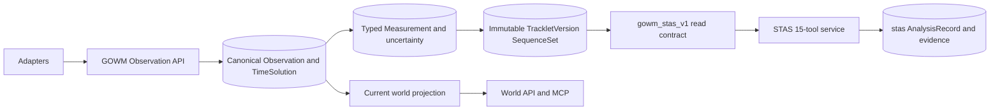

# GOWM+ and STAS unified platform v0.1.0

## Decision

GOWM is the single data foundation. STAS is a separately deployable application
that consumes a versioned read contract. This avoids two Observation,
Measurement, and Tracklet authorities while retaining STAS release isolation.

The detailed entity, constraint, versioning, and migration design remains in
`docs/13_GOWM_PLUS_V1_2_ARCHITECTURE.md`. This document records the integrated
v0.1.0 deployment decision.

## Contract and storage boundary

- GOWM owns `public` canonical tables. Observation/time/measurement and
  TrackletVersion records are immutable; heads are controlled current pointers.
- `gowm_stas_v1` is the versioned adapter surface. UUIDs are stable public
  contract identities while GOWM text keys remain upgrade-compatible authority.
- STAS owns only `stas.analysis_record` and typed input/evidence tables.
- `stas_app` may resolve extension functions in `public`, read contract views,
  and insert sink rows. It has no base-table read/write privilege.
- Scope validation is enforced at HTTP and in security-definer triggers with a
  fixed `pg_catalog,public,stas` search path.

## Time, gaps, and uncertainty

- Event time is a versioned `observation_time_solution`, not a mutable column.
- A TrackletVersion is a MobilityDB `tgeompoint(SequenceSet,Point)` derived from
  frozen measurement/time inputs.
- Interpolation is linear only inside one sequence. Inter-sequence ranges are
  explicit gaps with observability state; they are never filled implicitly.
- Nominal geometry, hard-radius sensitivity, source quality, coverage, and
  prerequisites remain separate dimensions. A missing prerequisite yields
  `NO_DATA` or `INDETERMINATE`, not a negative operational conclusion.

## Application surface

The STAS registry exposes exactly 15 P0 tools: tracklet read/gaps/quality/slice,
position, motion/stops, region interaction/search, nearest/proximity/nearby,
successor candidates, pair features, and sensor coverage. Every result includes
method/version/hash, pinned snapshot IDs, evidence, gaps, uncertainty,
assumptions, quality, warnings, and execution counts/timing.

## Deployment

Compose deploys one pinned database and an independently restartable `stas`
container using its own login and health check. World APIs, observation ingest,
projection, MQTT, MCP, and simulator remain separate units. Future spatial, H3,
CRS, and route services must consume GOWM contracts and own only derived data.

## Release decision

`INTEGRATION_CONDITIONAL_PASS`: the engineering and integration gates described
in `validation/FINAL_ACCEPTANCE.md` pass. Production qualification is separate
and remains blocked by trusted authentication/scope claims, certified production
CRS, live MQTT recovery, backup/PITR rehearsal, and target-scale SLO evidence.
